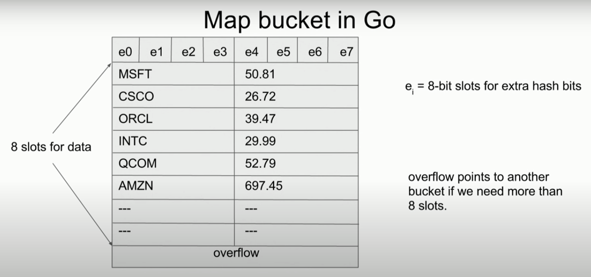

# 面试准备之`Golang Map` 的实现与细节


单词： `bot`  n.自治程序 

> an autonomous program on the internet or another network that can interact with system or users.

这个[视频](https://www.youtube.com/watch?v=Tl7mi9QmLns&t=35s)讲了一些关于`Golang Map` 实现的一些细节，很不错！这篇文章也参考了里面的一些内容。


## What are maps？ 什么是`Map`


Associative containers mapping keys to values.

- Construct:  `m := map[key]value{}`
- Insert: `m[k] = v `
- Lookup: `v, ok = m[k]`
- Delete: `delete(m, k)`
- Iterate: `for k, v := range m`
- Size: `len(m)`

>  Note: Key type must have an `==` operation (no maps, slices, or funcs as keys) but channel can be key.

Operation run in constant time.


---

## Idea: split data up into buckets!


## Hash function

Choose a bucket for each key so that entries are distributed as evenly as possible.

`bucket = h(key)`


Required for correctness:

- Deterministic: k1 == k2 ---> h(k1) == h(k2)

Want for performance:

- Uniform: Probability[h(k) == b] ~= 1/#buckets
- Fast: h(k) can be computed quickly
- Adversary safe: hard for attacker to find lots of k with h(k) == b

Good news: Such hash functions exist.

Bad news: Hard to get right.

Go gets it right for you. ---> no user-defined hash functions.


## Map bucket in Go




一个 `bucket` 有 8 个槽，另外还有一个 `overflow` 段。 如果冲突的多了，8个槽不够放置，我们则需要 `overflow` 指向另一个 `bucket`用来存储多余的 `key-value`。


## Map in Go


当你定义并初始化了一个`map` ，其实 `m`是一个指向一个`map header`的指针。

`len`： 表示了当前在`map`中 `entry` 的多少。

`lg`: 表示当前我们用了多少 `bucket` (总是 2的幂次个) 所以我们都是对这个数取`log`,把它弄小并保存起来。

`bucket array`: 指向 `bucket array`的指针。


---

## Lookup

`v = m[k]`

compiles to 

`v = runtime.lookup(m, k)` 但是一个问题来了：`runtime` 如何知道 `m` 的`key` 是什么类型，值又是什么类型...


## Faking generics

- All operations are done using **`unsafe.Pointers`** pointing to values of generic type.

- Type information for each value is handled by a ***type descriptor***

- Type descriptors provide operations like **==**, **hash**, **copy**.

  ```go
  type _type struct {
      size uintptr
      equal func(unsafe.Pointer, unsafe.Pointer) bool
      hash func(unsafe.Pointer, uintptr) uintptr
      ...
  }
  // instead of having a key we have a pointer to a key, similarly instead of having a vlaue we have a pointer to a value.
  type mapType struct {
      key *_type
      value *_type
      ...
  }
  ```

  

## Lookup


`v = m[k]`

compiles to 

```go
pk := unsafe.Pointer(&k)
pv := runtime.lookup(typeof(m), m, pk)
v = *(*V)pv
```

where the runtime has the function

```go
func lookup(t *mapType, m *mapHeader, k unsafe.Pointer) unsafe.Pointer
```


## Lookup implementation

```go
// lookup looks up a key in a map and returns a pointer to the associated value.
// t = type of the map
// m = map
// key = pointer to key
func lookup(t *mapType, m *mapHeader, key unsafe.Pointer) unsafe.Pointer {
    if m == nil || m.count == 0 {
        return zero
    }
    
    hash := t.key.hash(key, m.seed) // hash := hashfn(key)
    bucket := hash & (1 << m.logB - 1) // bucket := hash % nbuckets
    extra := byte(hash >> 56) // extra := top 8 bits of hash
    b := (*bucket)(add(m.buckets, bucket*t.bucketsize)) // b := &m.buckets[bucket]
    
    for {
        for i := 0; i < 8; i++ {
            if b.extra[i] != extra { // check 8 extra hash bits
                continue
            }
            k := add(b, dataOffset + i * t.key.size) // pointer to k_i in bucket
            if t.key.equal(key, k) {
                // return pointer to v_i
                return add(b, dataOffset + 8 * t.key.size + i * t.value.size)
            }
        }
        b = b.overflow
        if b == nil {
            return zeroc
        }
    }
}
```


## Growing the map

When buckets get too full, we need to grow the map.

"too full" = average of 6.5 entries per bucket

1. Allocate a new array of buckets of twice the size

2. Copy entries over from the old buckets to the new buckets

3. Use the new buckets

   The process of copying is done incrementally, a little bit during each `insert` or `delete`. During copying, operations on the map are a bit more expensive.

---

## Maps in other languages


